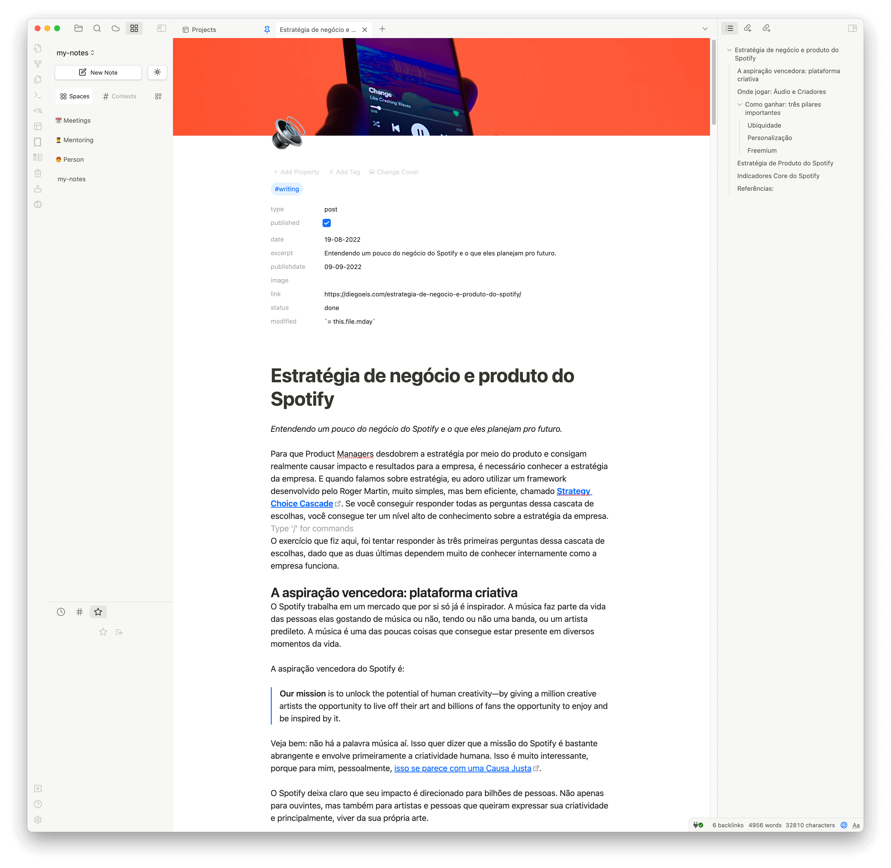

# Obsidianotion

Your Obsidian with the look of Notion design. 

In this case, the banner was inserted using [Banner Plugin](https://github.com/noatpad/obsidian-banners)

Works very fine with [Make.md plugin](https://github.com/Make-md/makemd)...

