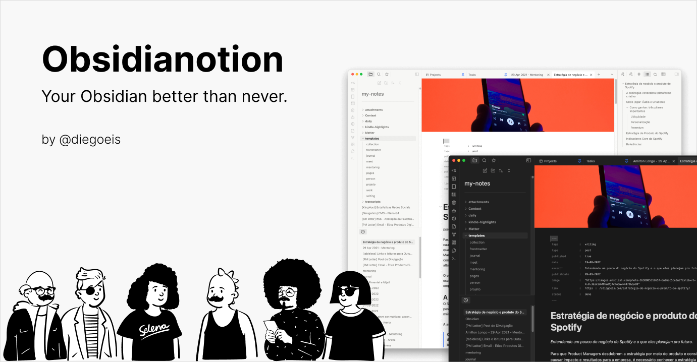

## Navigations

- [About Obsidianotion](#about-obsidianotion)
  - [To install](#to-install)
  - [Style Settings](#style-settings)
  - [Companion plugins](#companion-plugins)

Do you have any suggestions or feedback, please, let me know: [https://forms.gle/AnQgXjt56NSmhDnn6](https://forms.gle/AnQgXjt56NSmhDnn6)

# About Obsidianotion

Your Obsidian with a similar look and feel of Notion. But it's better because it's Obisidian!
I know it can be challenging to migrate between tools, and the processn can greatly impact your productivity. That's why good design can help accelerate the learning curve by creating a familiar context of experience to help us focus on the only thing that matters: note-taking.

This theme can help people who are migrating from Notion to Obsidian to feel more comfortable with the new flow and interface. It can also be a beautiful theme for those who already use Obsidian frequently.


My graph view:


Settings modal:


Obsidianotion supports a wide number of alternate checkbox types. These allow you to call out tasks that are incomplete, canceled, rescheduled, etc. See below for availale checkbox types.


```
Basic checklists:
- [ ] to-do
- [/] incomplete
- [x] done
- [-] canceled
- [>] forwarded
- [<] scheduling

Extras checklists:
- [?] question
- [!] important
- [*] star
- ["] quote
- [l] location
- [b] bookmark
- [i] information
- [S] savings
- [I] idea
- [p] pros
- [c] cons
- [f] fire
- [k] key
- [w] win
- [u] up
- [d] down
```

_These are the same checkbox styles used in [Things](https://github.com/colineckert/obsidian-things) and [Minimal](https://minimal.guide/Block+types/Checklists#Checkbox+styling) themes. So, give it a try too._

Beatifull typo and wonderfull reading:


## To install

1. Open the **Settings** in Obsidian;
1. Navigate to **Appearance** tab;
1. Under the **Themes** section, click on the `Manage` button across from **Themes**
1. Search for `Obsidianotion` in the Search field text
1. Click `Use` and then you're done! 🎉

## Style Settings

You can customize some of visuals installing the [Plugin Style Settings](https://github.com/mgmeyers/obsidian-style-settings). The theme works very fine without it, but if you wanna change the headings and body paragraph font size or even the default color of sidebar, you will can.


This settings will grow with time!

## Companion plugins

To install the plugins that have a good fit with Obsidianotion:

- Go to `Community plugins` and turn off `Safe mode`
- Under community themes search for the plugins name and click `Install`, then `Enable`

The banner in this image was inserted using [Banner Plugin](https://github.com/noatpad/obsidian-banners).


This theme works very good using [Make.md plugin](https://github.com/Make-md/makemd).


[Projects](https://github.com/marcusolsson/obsidian-projects) to create views using your tags, dataview or folders.


