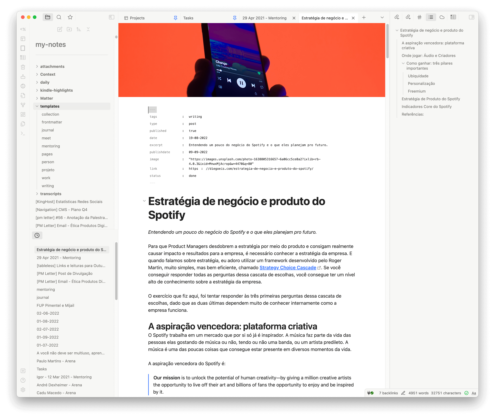

# Obsidianotion

Your Obsidian with a similar look and feel of Notion. But it's better because it's Obisidian!
I know it can be challenging to migrate between tools, and the processn can greatly impact your productivity. That's why good design can help accelerate the learning curve by creating a familitar context of experience to hlep us focus on the only thing that matters: note-taking.

This theme can help people who are migrating from Notion to Obsidian to feel more comfortable with the new flow and interface. It can also be a beautiful theme for those who already use Obsidian frequently.

## To install

Just look for Obsidianotion in Settings > Appearance > Manage button

## Great plugins that fit very well

The banner in this image was inserted using [Banner Plugin](https://github.com/noatpad/obsidian-banners).

This theme works very good using [Make.md plugin](https://github.com/Make-md/makemd).

